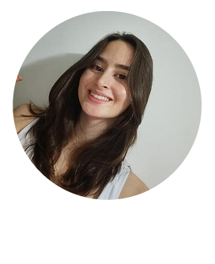

# 🌟 Portfólio de Marianne Valério! 🌟
  

Olá! Eu sou a Marianne — seja muito bem-vindo(a) ao meu portfólio 😊✨  
Aqui você encontrará um pouco da minha trajetória profissional, alguns dos projetos que desenvolvi e os principais canais para entrar em contato comigo.  

Para saber **mais sobre mim**, acesse os links abaixo:
- [🔗 Perfil no LinkedIn](https://www.linkedin.com/in/marianne-val%C3%A9rio-nunes-701568292/)
- [📧 E-mail para contato](mailto:valerionunesm@gmail.com)
- [🐙 Repositórios do GitHub](https://github.com/mariannevalerion?tab=repositories)
- [📄 PDF do Currículo](arquivos/MarianneValério.pdf)*

## 📚 Resumo sobre mim

**Formação**
- Estudante de **Desenvolvimento de Software Multiplataforma** (3° semestre | Matutino) na FATEC São José dos Campos (2024 – 2027)
- Curso de **Operador de Microcomputador** pelo 
Senai São José dos Campos (Abril de 2023 – Junho de 2023)

**Voluntariados:**
- Voluntária na escola E.E. Profª Maria Dolores Veríssimo Madureira como acolhedora (2024) 
- Voluntária dando aula de música na Igreja Cristã Maranata (2024 – 2025)
- Voluntária na organização do evento SBPO(Simpósio Brasileiro de Pesquisa Operacional)  (2023)

<h2 id="meus-projetos">Meus Projetos</h2>
  <ul>
    <li><h3 id="smart-farm"> SmartFarm • 1º Semestre • 2024/01 </h3>
       
      

        <a href="https://github.com/SkyFlyTeam/SmartFarm" target="_blank">Repositório do Projeto</a> • Equipe SkyFly
      

      <b>📑 Descrição do Problema </b>
      
 A equipe I9, do curso de Manufatura Avançada da FATEC, identificou que o processo de coleta e análise de dados ambientais em estufas inteligentes, feito manualmente via Excel, é lento, propenso a erros e exige muito da equipe técnica. Essa limitação dificulta o acompanhamento eficiente do cultivo de plantas e hortaliças, impactando diretamente na produtividade e no controle ambiental. 
      

       
      <b>🎯 Objetivo</b>
      
 Desenvolver um painel de visualização capaz de monitorar em tempo real as condições da estufa por meio de gráficos interativos e automatizar tanto a coleta quanto o armazenamento de dados ambientais. O foco é melhorar a eficiência, reduzir o esforço manual e garantir mais precisão no monitoramento.
      

       
      <b>💡 Solução  </b>
      
 Foi criado um site com interface amigável e intuitiva, que realiza comunicação direta com a placa utilizada, de forma que os dados capturados pela estufa são apresentados de forma visual e clara em tempo real. A plataforma permite acompanhar as variáveis ambientais da estufa por meio de gráficos, facilitando a tomada de decisões. 
      

       
      <b> 🛠️ Tecnologias Utilizadas </b>
      
 

      

       
      <b>🙋‍♀️ Contribuições pessoais  </b>
      
 Atuei como desenvolvedora da equipe SkyFly, ajudando na elaboração do protótipo inicial da aplicação e sendo responsável pelo desenvolvimento do frontend. Colaborei ativamente com meus colegas de equipe, oferecendo suporte técnico, especialmente nas etapas que envolviam HTML e CSS, visto que muitos estavam tendo o primeiro contato com essas tecnologias. Minha experiência prévia foi fundamental para orientar o time e garantir um desenvolvimento mais fluido e colaborativo. Também desenvolvi algumas funcionalidades no backend, como rotas para retornar com os dados a serem exibidos nos gráficos. 
      

      

        <b> Habilidades adquiridas: </b>
        

          

            
Hard Skills 

            <ul>
              <li> HTML/CSS </li>
              <li> Docker </li>
              <li> MySQL </li>
              <li> Figma </li>
              <li> Git e Github </li>
            </ul>
          

          

            
Soft Skills 

            <ul>
              <li>Colaboração em equipe multidisciplinar: Cada membro da equipe tinha conhecimentos e pendia para uma área de desenvolvimento, como desenvolvedores frontend, backend e devOps. Isso exigiu um esforço conjunto para alinhar os objetivos e resolver problemas técnicos sem que cada um ficasse preso em seu núcleo, mas fosse capaz de aprender e contribuir em outras áreas. Pessoalmente, foi meu primeiro contato com o DevOps, por exemplo.</li>
            <li>Comunicação clara e didática com colegas: Durante o desenvolvimento da API, tive que documentar e explicar conceitos e ferramentas de forma acessível para os membros da equipe com diferentes níveis de conhecimento. Isso incluiu a explicação de decisões sobre o Figma, por exemplo, uma ferramenta que muitos nunca haviam utilizado.</li>
              <li>Proatividade na resolução de problemas e estudo de tecnologias: Durante o desenvolvimento da API, identifiquei a necessidade de utilizar o Pandas para a geração de gráficos e análise de dados, uma vez abrangi diversas funcionalidades já integradas que seria muito úteis para nosso cliente. Fui proativa em aprender sobre essa biblioteca e apliquei esse conhecimento para gerar relatórios visuais que facilitassem a interpretação dos dados.</li>
              <li>Organização e gestão de tempo: Para garantir que as entregas fossem feitas dentro do prazo, organizei meu tempo de maneira eficiente, priorizando tarefas de acordo com a urgência. Isso foi essencial no processo de desenvolvimento da API, onde a gestão do tempo foi fundamental para a integração de várias funcionalidades de forma coesa e sem comprometer a qualidade do código.</li>
              <li>Adaptabilidade a diferentes níveis de conhecimento técnico: Durante o projeto, a equipe possuía membros com diferentes níveis de experiência. Adaptar minha comunicação e abordagem de trabalho a esses diferentes níveis foi fundamental para garantir que todos os membros pudessem contribuir efetivamente no desenvolvimento da API, mesmo aqueles com menos experiência em algumas tecnologias.</li>
              <li>Empatia e apoio ao aprendizado dos colegas: Sempre que um membro da equipe encontrava dificuldades técnicas, oferecia apoio, seja ajudando com a sua task na API ou sugerindo recursos educativos.</li>
            </ul>
          

        

      

       
      <b>📚 Lições Aprendidas</b>
       
       
      
 Durante o desenvolvimento do projeto SmartFarm, aprofundei meus conhecimentos no desenvolvimento de APIs com Python, utilizando o framework Flask. Trabalhei com a manipulação de grandes volumes de dados, focando na sua organização e exibição de forma acessível por meio de gráficos construídos com o uso do Pandas, uma biblioteca amplamente utilizada no mercado. Além dos aprendizados técnicos, também evoluí significativamente na comunicação e colaboração em equipe, contribuindo ativamente com o compartilhamento de conhecimentos e apoiando meus colegas ao longo do projeto.

    </li>
      
    <li><h3 id="cloud-stock"> CloudStock • 2º Semestre • 2024/02 </h3>
       
       

        <a href="https://github.com/SkyFlyTeam/cloudStock" target="_blank">Repositório do Projeto</a> • Equipe SkyFly
      

      <b>📑 Descrição do Problema </b>
      
 A problemática foi apresentada por um cliente interno da FATEC, que relatou dificuldades no gerenciamento de estoque, devido a processos manuais e descentralizados. Esses métodos estavam sujeitos a falhas humanas, falta de rastreabilidade e ausência de relatórios em tempo real, comprometendo a eficiência operacional e a tomada de decisões estratégicas.
      

       
      <b>🎯 Objetivo</b>
      
 Desenvolver um sistema de controle de estoque capaz de organizar, automatizar e facilitar a gestão de produtos, fornecedores e movimentações de estoque. O objetivo foi garantir maior controle sobre o inventário, reduzir erros e permitir uma visualização clara de entradas, saídas e níveis de estoque.
      

       
      <b>💡 Solução  </b>
      
 Foi desenvolvido um website completo e intuitivo, com funcionalidades como cadastro de itens e fornecedores, controle de entradas e saídas, geração de relatórios e alertas automáticos. A plataforma oferece uma experiência prática e organizada, promovendo maior controle logístico e agilidade na gestão de estoque por parte das empresas.
      

       
      <b> 🛠️ Tecnologias Utilizadas </b>
      
 

      

       
      <b>🙋‍♀️ Contribuições pessoais  </b>
      
 Atuei como desenvolvedora da equipe SkyFly, ajudando na elaboração do protótipo inicial da aplicação e sendo responsável pelo desenvolvimento tanto do frontend, quanto do backend. Participei ativamente da modelagem do Banco de Dados e também nas discussões sobre os requisitos apresentados. Desenvolvi algumas funcionalidades chaves, como por exemplo o sistema de notificações utilizando triggers e websocket.
      

    
   <ul>
    <li><h3 id="smart-farm"> GSW • 3º Semestre • 2025/08 </h3>
       
      

        <a href="https://github.com/the-devs-department/GSW-2025.2-3Sem" target="_blank">Repositório do Projeto</a> • Equipe The Devs
      

A problemática apresentada pela empresa GSW envolve a necessidade de um sistema eficiente para o gerenciamento de tarefas. Atualmente, muitas equipes enfrentam dificuldades para organizar atividades, acompanhar prazos, controlar a colaboração entre membros e manter registros confiáveis de alterações. Além disso, a ausência de uma plataforma integrada compromete a produtividade, dificulta a visualização de tarefas em equipe e aumenta os riscos de perda de informações importantes, como anexos, históricos e notificações.
  

<b>🎯 Objetivo</b>

Desenvolver uma aplicação web moderna e responsiva que permita gerenciar tarefas de forma completa, incluindo criação, edição, exclusão, conclusão, categorização e atribuição entre usuários. O objetivo é otimizar a organização individual e em equipe, garantindo controle de prazos, centralização de documentos, segurança de acesso, integração com calendários externos e visibilidade para administradores por meio de logs de auditoria e filtros avançados.
  

<b>💡 Solução</b>

A solução proposta consiste em uma plataforma robusta de gerenciamento de tarefas, integrando funcionalidades como login seguro, criação de equipes, anexos de arquivos, notificações, filtros inteligentes e interface intuitiva com arrastar e soltar (Kanban). Com o uso de tecnologias como React, Tailwind, Java com Spring e MongoDB, o sistema oferece uma experiência fluida e escalável. A plataforma possibilita que usuários organizem atividades, acompanhem prazos e colaborem com suas equipes, enquanto administradores têm acesso a logs detalhados e ferramentas avançadas de gestão, promovendo eficiência, transparência e produtividade no ambiente corporativo.

</b>
<b> 🛠️ Tecnologias Utilizadas </b>

 

 
<b>🙋‍♀️ Contribuições Pessoais</b>

 
Atuei de forma ativa no desenvolvimento do projeto, contribuindo tanto no backend quanto no frontend. 
Participei da criação das principais funcionalidades da aplicação, colaborando diretamente na implementação, testes 
e organização do código. Durante o processo, também trabalhei com o banco de dados MongoDB, realizando a configuração,
integração e apoio na modelagem de dados utilizada pelo sistema. Além disso, participei das discussões e decisões 
relacionadas à arquitetura, aprendendo e aplicando conceitos de microsserviços e desenvolvimento em Java, que foram
novas tecnologias exploradas nesta disciplina.

  <b> Habilidades Adquiridas: </b>

  

            
Hard Skills

            <ul>
              <li>React</li>
              <li>Node.js</li>
              <li>TypeScript</li>
              <li>Spring Boot</li>
              <li>Microsserviços</li>
              <li>MongoDB</li>
              <li>Docker</li>
              <li>Figma</li>
              <li>Git e GitHub</li>
            </ul>
          

    

       
Soft Skills 

            <ul>
              <li>Colaboração em equipe multidisciplinar: Cada membro da equipe tinha conhecimentos e pendia para uma área de desenvolvimento, como desenvolvedores frontend, backend e devOps. Isso exigiu um esforço conjunto para alinhar os objetivos e resolver problemas técnicos sem que cada um ficasse preso em seu núcleo, mas fosse capaz de aprender e contribuir em outras áreas. Pessoalmente, foi meu primeiro contato com o DevOps, por exemplo.</li>
            <li>Comunicação clara e didática com colegas: Durante o desenvolvimento da API, tive que documentar e explicar conceitos e ferramentas de forma acessível para os membros da equipe com diferentes níveis de conhecimento. Isso incluiu a explicação de decisões sobre o Figma, por exemplo, uma ferramenta que muitos nunca haviam utilizado.</li>
              <li>Proatividade na resolução de problemas e estudo de tecnologias: Durante o desenvolvimento da API, identifiquei a necessidade de utilizar o Pandas para a geração de gráficos e análise de dados, uma vez abrangi diversas funcionalidades já integradas que seria muito úteis para nosso cliente. Fui proativa em aprender sobre essa biblioteca e apliquei esse conhecimento para gerar relatórios visuais que facilitassem a interpretação dos dados.</li>
              <li>Organização e gestão de tempo: Para garantir que as entregas fossem feitas dentro do prazo, organizei meu tempo de maneira eficiente, priorizando tarefas de acordo com a urgência. Isso foi essencial no processo de desenvolvimento da API, onde a gestão do tempo foi fundamental para a integração de várias funcionalidades de forma coesa e sem comprometer a qualidade do código.</li>
              <li>Adaptabilidade a diferentes níveis de conhecimento técnico: Durante o projeto, a equipe possuía membros com diferentes níveis de experiência. Adaptar minha comunicação e abordagem de trabalho a esses diferentes níveis foi fundamental para garantir que todos os membros pudessem contribuir efetivamente no desenvolvimento da API, mesmo aqueles com menos experiência em algumas tecnologias.</li>
              <li>Empatia e apoio ao aprendizado dos colegas: Sempre que um membro da equipe encontrava dificuldades técnicas, oferecia apoio, seja ajudando com a sua task na API ou sugerindo recursos educativos.</li>
            </ul>
          

        

      

       

<b>📚 Lições Aprendidas</b>

Durante o desenvolvimento do projeto, aprofundei meus conhecimentos em Java, Spring Boot e arquitetura de 
microsserviços — tecnologias que até então eram novas para mim. Também aprendi a trabalhar com banco de dados 
NoSQL (MongoDB), compreendendo melhor seu funcionamento, flexibilidade e vantagens em sistemas modernos.
Além das habilidades técnicas, o projeto me ajudou a evoluir no trabalho em equipe, comunicação e organização,
fortalecendo minha capacidade de colaborar e entregar resultados de forma eficiente.

